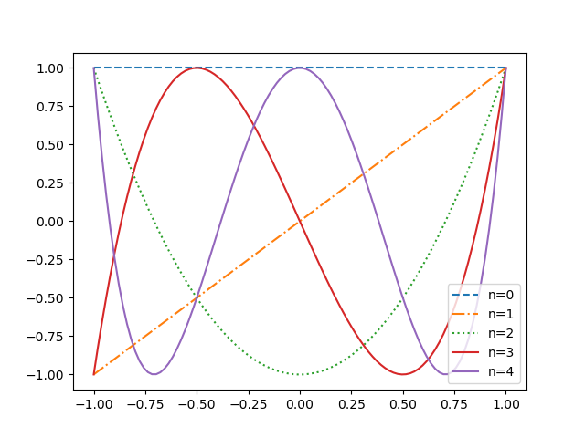

# Interpolação polinomial 

Interpolação é um tipo de estimação de curva que constrói novos pontos a
partir de um conjunto finito. Em geral, a partir de uma amostragem ou
experimento, obtemos um sequência de pontos e os valores da função
correspondentes. No caso de polinômios, a ideia é encontrar um polinômio que
passe pelos dados a serem analisados. 
$$
P_n(x) = a_0 + a_1 x + a_2 x^2 + \dots + a_n x^n
$$
é polinômio de grau no máximo $n$ e $a_0, a_1, \dots, a_n$ são constantes
reais. Dizemos que $P_n[x] \in \mathbb{R}[x]$, isto é, é um polinômio na
variável $x$ com constantes reais. 

> Teorema da Aproximação de Weierstrass 

Seja $f$ contínua em $[a,b]$. Para cada $\epsilon > 0$, existe um polinômio
$p(x)$ tal que 

$$
|f(x) - p(x)| < \epsilon, \forall x \in [a,b].
$$

[Demonstração por Dunham Jackson.](http://vigo.ime.unicamp.br/MT401-2016/2012INPsuitesD1bis.pdf)

> Existência de polinômio interpolador

Considere os pontos $(x_i, y_i), i = 1, \dots, n$ com pontos 
$x_i$ todos diferentes. Então existe um único polinômio 
$p(x)$ de grau no máximo $n-1$ tal que $p(x_i) = y_i$ para
$i = 1, \dots, n$. 

Esse problema tem solução se o sistema $Xa = b$ tem solução
em que 

$$
X = \begin{bmatrix}
    1 & x_0 & \cdots & x_0^n \\
    1 & x_1 & \cdots & x_1^n \\
    \vdots & \vdots & \ddots & \vdots \\
    1 & x_n & \cdots & x_n^n
\end{bmatrix}, a = \begin{bmatrix}
    a_0 \\ a_1 \\ \vdots \\ a_n
\end{bmatrix} \text{ e } b = \begin{bmatrix}
    f(x_0) \\ f(x_1) \\ \vdots \\ f(x_n).
\end{bmatrix}
$$

Esse sistema tem solução se $\det(X) \neq 0$, isto é, o 
determinante de **Vandermonde** é não nulo. 

$$
\det(X) = \prod_{i > j} (x_i - x_j) = \prod_{j=0}^{n-1} 
\left[\prod_{i=j+1}^n (x_i - x_j) \right] \neq 0 \iff x_i \neq x_j, j \neq i.
$$

Nesse caso, existe um único $a$ solução desse sistema 
que define o polinômio interpolador $p(x)$. 

Se $P_n(x_i) = Q_n(x_i)$ para $n+1$ pontos $x_0, x_1, 
\dots, x_n$, então $P_n(x) = Q_n(x)$ para todo $x$. 
Esse resultado é direto se considerarmos as raízes 
do polinômio $D(x) = P_n(x) - Q_n(x)$ (que tem no máximo)
$n$ raízes se não for identicamente nulo.

## Polinômios de Lagrange 

Defina 
$$
L_{n,k}(x) = \frac{(x-x_0)\cdots(x - x_{k-1})(x - x_{k+1})\cdots(x - x_n)}{(x_k-x_0)\cdots(x_k - x_{k-1})(x_k - x_{k+1})\cdots(x_k - x_k)}.
$$

É fácil ver que 

$$
L_{n,k}(x_i) = \begin{cases}
    0, & \text{se } i \neq k \\
    1, & \text{se } i = k.
\end{cases}
$$

Assim, podemos definir 

$$
p(x) = \sum_{k=0}^n f(x_k)L_{n,k}(x). 
$$

que é o polinômio interpolador de Lagrange. Se os pontos 
são diferentes, isto é, $x_0 \neq x_1 \neq \cdots \neq x_n$.

> Teorema de erro pontual na interpolação

Seja $f(x) \in C^{(n+1)}[a,b]$ e $p_n(x)$ o polinômio 
interpolador com os pontos distintos $x_0, x_1, \dots, x_n$.
Então para todo $x \in [a,b]$, existe um ponto $\xi = \xi(x)$ 
tal que 
$$
\min(x_0, x_1, \dots, x_n, x) < \xi < \max(x_0, x_1, \dots, x_n, x),
$$
e 
$$
f(x) - p_n(x) = \frac{(x-x_0)(x-x_1)\cdots(x-x_n)}{(n+1)!}f^{(n+1)}(\xi).
$$

## Fenômeno de Runge

É um problema de oscilação nas bordas de um intervalo
que ocorre ao se usar a interpolação polinomial 
com polinômio de alto grau em um conjunto de pontos *equidistantes*. 
Foi descoberto por Carl David
Tolmé Runge que mostrou que aumentar o grau não 
aumenta precisão necessariamente. 

Considere a função 
$$
f(x) = \frac{1}{1 + 25x^2}
$$
e defina $x_i = \frac{2i}{n} - 1, i \in \{0, 1, \dots, n\}$
com um polinômio de grau no máximo $n$. Podemos provar que 
$$
\lim_{n \to \infty}\left(\max_{-1 \le x \le 1} |f(x) - P_n(x)|\right) = +
\infty. 
$$

Vamos verificar empiricamente, é claro. 

## Polinômios de Chebyshev

Um tópico importante dentro da interpolação 
e da estimação de curvas de forma geral são 
os polinômios **ortogonais**. Lembrando que uma
base ortogonal ocorre quando o produto interno 
de dois elementos da base diferentes é nulo. 
Isso acontece com os polinômios também, só 
que o produto interno é 

$$
\langle \phi_k, \phi_j \rangle = \int_a^b w(x)\phi_k(x)\phi_j(x) \, dx, 
$$
em que $w(x)$ é uma função peso. Note que essa 
é uma extensão do produto escalar que é a soma 
finita dos produtos dos componentes dos vetores. 
Esse é um assunto muito interessante, mas vamos 
ao tópico. Os polinômios de CHebyshev formam uma
base ortogonal em $[-1,1]$ com respeito a função
peso $w(x) = (1 - x^2)^{-1/2}$. Definimos 

$$
T_n(x) = \cos(n\arccos(x)), n \ge 0, x \in [-1,1].
$$

Para verificar que $T_n$ é um polinômio, note que 

$$
T_0(x) = \cos(0) = 1, \quad T_1(x) = \cos(\arccos(x)) = x.
$$
Além do mais, sabemos que 
$$
T_{n+1}(x) = \cos((n+1)\theta) = \cos(\theta)\cos(n\theta) - 
\sin(\theta)\sin(n\theta)
$$
e 
$$
T_{n-1}(x) = \cos((n-1)\theta) = \cos(\theta)\cos(n\theta) + 
\sin(\theta)\sin(n\theta),
$$
pondo $\theta = \arccos(x)$. Assim, é fácil ver que 
$$
T_{n+1}(x) + T_{n-1}(x) = 2xT_n(x) \implies T_{n+1}(x) = 2xT_n(x) -
T_{n-1}(x). 
$$
Por indução, conseguimos ver que $T_n$ é de fato
um polinômio. Esses polinômios são usados 
para minimizar o erro de aproximação de uma 
interpolação. No caso dos polinômios de Lagrange, 
isso se dá pela escolha apropriada de $x_1, x_2, \dots, x_n$. 

> Zeros do polinômio de Chebyshev

O polinômio $T_n(x)$ de grau $n \ge 1$ tem $n$ zeros *simples* 
(multiplicidade $1$) em $[-1,1]$ em 
$$
\bar{x}_k = \cos\left(\frac{2k-1}{2n}\pi\right), k = 1,\dots, n.
$$
Além do mais, ele assume valores absolutos extremos em 
$$
x_k = \cos\left(\frac{k\pi}{n}\right) \text{ com } T_n(x_k)= (-1)^k, k =0,1,\dots,n.
$$

> Máximo atingido 

Seja $\tilde{T}_n(x) = T_n(x)2^{1-n}$. Temos que 

$$
\frac{1}{2^{n-1}} = \max_{x \in [-1,1]} |\tilde{T}_n(x)| \le \max_{x \in
[-1,1]} |P_n(x)|, 
$$
para todo polinômio *mônico* $P_n(x)$. Além disso a igualdade só
ocorre para o polinômio de Chebyshev. 

> Escolha de $x_i$ para Lagrange

Lembre que 

$$
f(x) - p(x) = \frac{f^{(n+1)}(\xi(x))}{(n+1)!}(x-x_0)\cdots(x-x_n).
$$
Como $Q(x) = (x-x_0)\cdots(x-x_n)$ é um polinômio mônico de grau $n+1$, 
escolhendo $x_i$ para serem as raízes do polinômio de Chebyshev, estaremos
fazendo $Q(x) = \tilde{T}_{n+1}(x)$ para todo $x \in [-1,1]$. 
Assim, obtemos que 
$$
\frac{1}{2^{n}} = \max_{x \in [-1,1]} |(x-\bar{x}_0)(x-\bar{x}_1)\cdots(x-\bar{x}_n)|.
$$
O que implica que 
$$
\max_{x \in [-1,1]} |f(x) - p(x)| \le \frac{1}{2^{n}(n+1)!}\max_{x \in [-1,1]} |f^{n+1}(x)|.
$$

### Intervalo $[a,b]$

Agora que entendemos como escolher os pontos em $[-1,1]$, precisamos
extender para um intervalo fechado qualquer. Para isso, basta fazer
a mudança de variáveis 
$$
\tilde{x} = \frac{1}{2}[(b-a)x + a + b].
$$

## Sugestões 

[Material original de 1901: o texto não está em português, 
mas vale a pena olhar.](https://archive.org/details/zeitschriftfrma12runggoog)