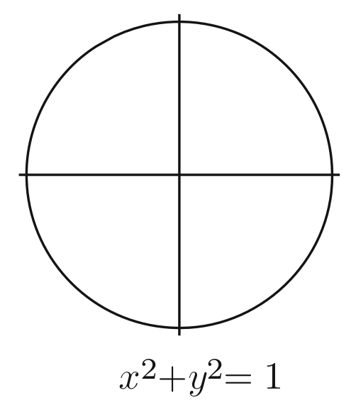
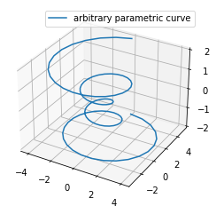

# Definições preliminares 

Quando pensamos em curvas, em geral, expressamos como uma equação, como, por exemplo, 

$$
x^2 + y^2 = 1 
$$
que é uma círcunferência 

 

ou talvez na reta $y = ax + b$. Chamamos essas curvas de **curvas de nível**, aquelas que são do tipo $f(x,y) = c$ para uma função $f:\mathbb{R}^2 \to \mathbb{R}$ continua. Todavia uma definição um tanto melhor é pensar em uma curva como um caminho traçado por um ponto se movimentando. 

**Curva parametrizada:** Seja $I$ um intervalo. Uma curva parametrizada é uma aplicação contínua $\alpha: I \subset \mathbb{R} \to \mathbb{R}^n$, muitas vezes notada como $\alpha(t) = (\alpha_1(t), ..., \alpha_n(t))$ e $t$ é chamado de parâmetro. 

**Traço da curva:** Seja uma curma $\alpha:I \to \mathbb{R}^n$. Dizemos que o traço de $\alpha$ é a imagem da aplicação $\alpha$, denotada $\alpha(I)$. Algumas definições de curva são precisamento o que definimos de traço da curva. 


```python
import numpy as np
import matplotlib.pyplot as plt
```


```python
fig = plt.figure()
ax = fig.gca(projection='3d')

# Prepare arrays x, y, z
theta = np.linspace(-4 * np.pi, 4 * np.pi, 100)
z = np.linspace(-2, 2, 100)
r = z**2 + 1
x = r * np.sin(theta)
y = r * np.cos(theta)

ax.plot(x, y, z, label='arbitrary parametric curve')
ax.legend()

plt.show()
```





## Encontrando parametrizações

### Exemplo 1

Vamos encontrar uma parametrização para a *parábola*  $y = x^2$ na reta. Seja $\gamma(t) = (\gamma_1(t), \gamma_2(t))$. Pela relação, temos que $\gamma_2(t) = \gamma_1(t)^2, \forall t \in \mathbb{R}$. Uma solução trivial sera colocar $\gamma_1(t) = t$. Nesse caso, $\gamma(t) = (t,t^2)$ é uma curva cujo traço é uma parábola. Observe que essa **não é a única parametrização**. Por exemplo $(\frac{t}{2}, \frac{t^2}{4})$ também é uma parametrização na reta. Isso levanta uma questão: temos duas parametrizações diferentes para a mesma curva. Como dizer que elas são iguais, em um certo sentido, já que suas imagens são iguais? 

### Exemplo 2 

Considere a curva [astroide](https://en.wikipedia.org/wiki/Astroid) dada pela pela equação $x^{2/3} + y^{2/3} = 1$. Uma maneira é propor a parametrização dada por $x(t) = t$ e $y(t) = (1 - t^{2/3})^{3/2}.$ Primeiro temos que observar que $t \in [-1,1]$ devido a raiz quadrada que tomamos na expressão - o valor dentro do parênteses não pode ser negativo. Em particular $y$ não pode ser negativo nessa parametrização. Isso não corresponde a imagem total da curva, pois $y^{2/3} + x^{2/3} = 1$ é simétrico em relação ao dois eixos. 

Poderíamos tentar adaptar essa parametrização, mas o mais conveniente é lembrar da identidade trigonométrica $cos^2(t) + sen^2(t) = 1$. Assim podemos escrever que $(cos(t)^3)^{2/3} + (sen(t)^3)^{2/3} = 1$. Como consequência $(cos^3(t), sen^3(t))$ é uma parametrização da astroide. Note que essa curva é contínua e definida em toda reta. 


```python
# Astroid
fig = plt.figure(figsize = (5,5))
ax = plt.subplot()
ax.grid(alpha=.5)

t = np.linspace(-np.pi, np.pi,100)
x = np.cos(t)**3
y = np.sin(t)**3

ax.plot(x, y, label='Astroid')
ax.axvline(x = 0, color = 'grey', alpha = .7)
ax.axhline(y = 0, color = 'grey', alpha = .7)
ax.legend()

plt.show()
```


## Vetor tangente

Em geral, quando estudamos curvas e superfícies, é comum encontrar o tempo *suave* associado. A definição de função suavde varia em cada contexto e pode ir desde uma função diferenciável com função contínua até função que tem derivada de qualquer ordem (sempre considerando o intervalo $I$ de definição. 

Lembre que se $\gamma(t) = (\gamma_1(t), ..., \gamma_n(t)$, a derivada de $\gamma$ é 
$$\dot{\gamma(t)} = (\dot{\gamma_1}(t), ..., \dot{\gamma_n}(t)).$$

**Vetor tangente:** Seja $\alpha$ uma curva parametrizada. Sua primeira derivada $\dot{\alpha}(t)$ é chamada de vetor tangente a cada tempo $t$. 

### Proposição 

Se o vetor tangente de uma curva parametrizada é constante, então o traço da curva é parte de uma reta. De fato se $\dot{\alpha}(t) = c$, onde $c$ é um vetor constante, pelo teorema fundamental do cálculo, 
$$
\alpha(t) = \int_{t_0}^t \dot{\alpha}(s)ds = (t - t_0)c = ct + d, d = - t_0 c, t_0 \in I
$$
Se $c \neq 0$, esta é a equação paramétrica de um segmento de reta (potencialmente infinito). Se $c = 0$, a imagem da curva é um único ponto. 

## Comprimento de arco 


## Reparametrização


## Curvas fechadas


```python

```
