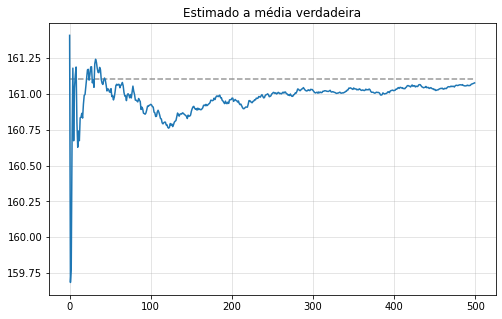

# Estimadores não enviesados

### Definição

Um estimador $\delta(X)$ é dito não enviesado para $g(\theta)$ se $E_{\theta}[\delta(X)] = g(\theta)$ para todo valor de $\theta$. O viés do estimador é definido por $E_{\theta}[\delta(X)] - g(\theta)$. 

Se $\delta$ é um estimador com variância finita, então: 

$$
R(\theta, \delta) = Var(\delta) + Viés(\delta)^2
$$

## Estimador não enviesado para variância

$$s^2 = \hat{\sigma}_1^2 = \frac{1}{n-1}\sum_{i=1}^n (X_i - \bar{X}_n)^2$$


```python
# Importando bibliotecas
import numpy as np
import pandas as pd 

from IPython.display import display, Math  # Display latex

import matplotlib.pyplot as plt 
%matplotlib inline

np.random.seed(1000) # Garantindo reprodutibilidade
```

#### Nota: Por que garantir reprodutibilidade? 

Reprodutibilidade é a ideia de tornar o processo que foi feito por você reprodutível por qualquer outra pessoa, para que ela possa obter os mesmos resultados seguindo os mesmos passos que você. 

Quando escolhemos um número aleatório (*pseudoaleatório* na verdade), ele muda de tempos em tempos. Mas isso vai tirar a ideia de "garantir os mesmos resultados". O resultado pode ser parecido, mas não exatamente igual. 

Isso é muito importante no meio científico. 

## Exemplo

Vamos ver como se comporta esse estimador não viesado em uma população que representa o Brasil todo! Veja que eu não peguei dados online, porque quero TODA a população. Por isso vamos fazer uma simulação. A média verdadeira da distribuição é 161,1cm e o desvio padrão é 10cm. 


```python
# Tamanho da população
N = int(200e5)
# População gerada por simulação, usando a distribuição normal. 
population_height = pd.Series(np.random.normal(loc = 161.1, scale = 10, size = N))
```

Podemos ver a média dessa população.


```python
population_height.mean()
```


    161.10097546939974


O que a função `var` do pandas faz? Vamos comparar com o estimador trivial. 


```python
ddof = 1 # Se ddof = 0, teremos a divisão por N
population_height.var(ddof = ddof)
```


    100.02715920849081


Divindindo por $N$


```python
sigma_square_hat = ((population_height - population_height.mean())**2).sum()/N
sigma1_square_hat = ((population_height - population_height.mean())**2).sum()/(N-1)

display(Math(r'\hat\sigma^2 = {}'.format(sigma_square_hat)))
display(Math(r'\hat\sigma_1^2 = {}'.format(sigma1_square_hat)))
```


$\displaystyle \hat\sigma^2 = 100.02715420713488$


$\displaystyle \hat\sigma_1^2 = 100.02715920849283$


### Estimação dos Parâmetros

Vamos supor que não conhecemos os parâmetros da nossa população e podemos conhecer apenas uma amostra aleatória dela. Vamos fazer 500 dessas simulações 


```python
number_simulations = 500
sample_size = 30 

sample = pd.DataFrame(population_height.sample(n = number_simulations*sample_size, 
                                               replace=True, random_state = 100), 
                      columns = ['height'])

reshape = sample.to_numpy().reshape((-1,30))
samples = pd.DataFrame(reshape, columns = range(0,30))
```

Vamos estimar a média com a média amostral que é não viesada também! Além disso ela é o MLE. Estamos estimado para cada amostra a média! Se fizermos uma média das médias, veremos que ela chegará próximo a média verdadeira. 


```python
estimated_mean = samples.mean(axis = 1)  #Axis = 1 faz a média por linha. 

estimated_mean_of_means = estimated_mean.expanding().mean()
```


```python
fig, ax = plt.subplots(figsize = (8,5))
ax.plot(estimated_mean_of_means, label = 'Valor estimado')
ax.hlines(population_height.mean(), xmin = 0, xmax = number_simulations, 
          color = 'grey', linestyle = '--', alpha = 0.8, label = 'Valor verdadeiro')
ax.grid(alpha = 0.4)
ax.set_title('Estimado a média verdadeira')
plt.show()
```





Vamos comparar os estimadores para a variância, o viesado e o não viesado.


```python
df = pd.DataFrame({'enviesado (dividido por n)': samples.var(ddof=0, axis = 1).expanding().mean(),
                   'nao_viesado (dividido por n - 1)': samples.var(ddof=1, axis = 1).expanding().mean(),
                   'verdadeiro': pd.Series(population_height.var(ddof=0), index=samples.index)})
ax = df.plot()
ax.set_title('Estimadores para a variância')
ax.grid(alpha = 0.4)

plt.show()
```


```python
# Comparar com Conscistência 
```
