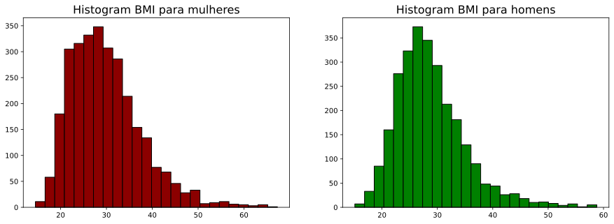

# Simples Exemplos em Teste de Hipóteses 

### Referência:  [Dr. Tirthajyoti Sarkar](https://github.com/tirthajyoti), Fremont, 94536

Vamos lembrar que nosso objetivo é testar hipóteses científicas com uma formulação estatística, a fim de fazer alguma inferência sobre os parâmetros de algum modelo. 

Os testes que serão discutidos nesse notebook são: 

1. Proporção de uma população. 
2. Deferença entre proporção de populações
3. Média de uma população. 
4. Diferença enre médias de populações. 


```python
import statsmodels.api as sm
import numpy as np
import matplotlib.pyplot as plt
import pandas as pd
```

## Proporção de uma População 

1. **Questão**: Em anos anteriores, 52% dos pais acreditavam que a falta de sono era causada por eletrônicos e as médias sociais em seus filhos e filhas adolescentes. E agora, como essa proporção se encontra? 

2. **População**: Pais com filhos e filhas adolescentes de 13 a 18 anos. 

3. **Parâmetro de interesse:** $p$

4. $H_0: p \le 0.52$ e $H_1: p > 0.52$. 

5. **Dados:** Pesquisa entre 1018 pessoas: 56% acreditam agora. 

### Teste Z para proporções 

Vamos usar um teste chamado teste Z, considerando que $X_1 , ..., X_n \sim Bernoulli(p)

$$
Z = \frac{\bar{X}_n - \pi_0}{\sqrt{(\pi_0(1 - \pi_0)/n)}}
$$

Onde $\pi_0$ é o valor limiar, no caso 0.52. 

Observe que quando $p = \pi_0$, a estatística $Z$ é aproximadamente normal padrão quando $n$ cresce. 

O que esse teste mensura? No denominador, temos o desvio padrão de quando $p = \pi_0$. Portanto, estamos medindo a distância entre a média amostral e o limiar em unidades de desvio padrão. Nosso procedimento de teste será, portanto, se $Z \ge c$, rejeitamos $H_0$, mas com nível de significância $\alpha_0$, isto é: 

$$
P(Z \ge c|p \le \pi_0) \le \alpha_0
$$

Podemos conferir que 

$$
\begin{split}
P(Z \ge c) &= P\left(\frac{\bar{X}_n - \pi_0}{\sqrt{(\pi_0(1 - \pi_0)/n)}} \ge c\right) \\
&= P\left(\frac{\bar{X}_n - p}{\sqrt{(p(1 - p)/n)}}\frac{\sqrt{(p(1 - p)/n)}}{\sqrt{(\pi_0(1 - \pi_0)/n)}} + \frac{p - \pi_0}{\sqrt{(\pi_0(1 - \pi_0)/n)}} \ge c\right) \\
&= P\left(\frac{\bar{X}_n - p}{\sqrt{(p(1 - p)/n)}} \ge c\frac{\sqrt{\pi_0(1 - \pi_0)}}{\sqrt{p(1 - p)}} - \frac{p - \pi_0}{\sqrt{(p(1 - p)/n)}}\right) \\
&\approx 1 - \Phi\left(c\frac{\sqrt{\pi_0(1 - \pi_0)}}{\sqrt{p(1 - p)}} - \frac{p - \pi_0}{\sqrt{(p(1 - p)/n)}}\right), \text{ pelo Teo. Central do Limite}
\end{split}
$$

Assim podemos encontrar $\alpha_0$ a partir do máximo que essa quantidade assume (Mas  com uma obseevação bem detalhada, quando $n$ é grande, $p = 0.52$ é o maximizador)

Mas como isso funciona na prática, propriamente dito.

Tenho que escolher um valor limiar para o p-valor, isto é, se p-valor for menor do que esse limiar, eu rejeito a hipótese. Vou ficar esse limiar em 0.05, mas isso é arbitrário, apesar da literatura costumar usá-lo. 


```python
n = 1018
pnull = .52
phat = .56
```


```python
ztest, pvalue = sm.stats.proportions_ztest(count = phat*n,   #número de sucessos
                                           nobs = n,          #número de observações
                                           value = pnull,    #pi_0
                                           alternative = 'larger') #hipótese alternativa 

print('O valor da estatística de teste foi {} e o p-valor {}'.format(ztest, pvalue))                        
```

    O valor da estatística de teste foi 0.6392739759907055 e o p-valor 0.26132235751888716


### Conclusão do teste de hipóteses

Como o p-valor foi menor do que nosso limiar, nós temos evidência para rejeitar a hipótese nula que dizia que a prporção teria permanecido ou até diminuído. 

Isso não significa que aceitamos a hipótese alternativa, apenas que temos evidência para acreditar que a proporção seja maior do que 0.52. 


```python
n = 1018
pnull = .52
phat = .53
```


```python
ztest, pvalue = sm.stats.proportions_ztest(count = phat*n,   #número de sucessos
                                           nobs = n,          #número de observações
                                           value = pnull,    #pi_0
                                           alternative = 'larger') #hipótese alternativa 

print('O valor da estatística de teste foi {} e o p-valor {}'.format(ztest, pvalue))        
```

    O valor da estatística de teste foi 0.6392739759907055 e o p-valor 0.26132235751888716


## Diferença entre propoções de duas populações 

1. **Questão**: Existe diferença significativa entre pais ingleses e pais alemães que reportaram que seus filhos e filhas tiveram aulas de natação? 

2. **População**: Pais com filhos e filhas ingleses e alemães. 

3. **Parâmetro de interesse:** $p_{ingleses} = p_i$ e $p_{alemaes} = p_a$.  

4. $H_0: p_i - p_a = 0$ e $H_1: p_i - p_a \neq 0$. 

5. **Dados:** 247 pais ingleses responderam e dentre eles 36.8% reportaram que sim. Pais alemães foram 308, 38.9% que disseram sim. 

### Teste T para proporções 

Na verdade, poderíamos usar o teste Z, com a mesma ideia, só que nesse caso, teríamos que tomar um pouco de cuidado com o denominador, dado que agora existem duas médias, então nosso estimador para o desvio padrão deve levar em conta esses dois fatores e $n$ deve ser suficientemente grande para que não tenhamos problema. 

Para evitar isso, vamos usar o T teste. A estatística de teste é a seguinte, tratando como $X$ e $Y$ as duas amostras consideradas. 

$$
t = \frac{\bar{X}_n - \bar{Y}_m}{SE}
$$

Nesse caso $SE$ é o erro entre a diferença entre a médias: isso tem um pequeno problema quando $m \neq n$. Então fazer as contas no papel não é trivial. 

Confira [aqui](https://en.wikipedia.org/wiki/Student%27s_t-test#Independent_two-sample_t-test) as definições de SE precisas. 

Como nossa intenção é apenas usar esse teste, vamos mostrar como isso pode ser prático. 


```python
n = 247
pi = .368

m = 308
pa = .389

# Gerando as populações

england = np.random.binomial(n = 1, p = pi, size = n)
germany = np.random.binomial(n = 1, p = pa, size = m)
```


```python
_, p_value, _ = sm.stats.ttest_ind(england, germany)

print('O p-valor foi {}'.format(p_value))
```

    O p-valor foi 0.2615435082780627


### Conclusão sobre o teste de hipóteses

Dado que o p-valor é maior do que nosso limiar, não podemos rejeitar a hipótese nula. Nesse caso, a diferença das proporções nas popuçações não foi nada mais do que meramente uma aleatoriedade. 


### Mas o que acontece se essas proporções se mantiveram para mais pessoas? 


```python
n = 5000
pi = .37

m = 5000
pa = .389

england = np.random.binomial(n = 1, p = pi, size = n)
germany = np.random.binomial(n = 1, p = pa, size = m)
```


```python
_, p_value, _ = sm.stats.ttest_ind(england, germany)

print('O p-valor foi {}'.format(p_value))
```

    O p-valor foi 0.027721099791980015


## Diferença entre médias de populações 

1. **Questão**: Considerando os adultos nos dados da [NHAMES](https://www.cdc.gov/nchs/nhanes/index.htm), homens tem maior média de [Índice de  Massa Corpórea](https://www.cdc.gov/healthyweight/assessing/bmi/index.html) do que mulheres? 

2. **População**: Adultos na base NHAMES. 

3. **Parâmetro de interesse:** $\mu_{homens} = \mu_h$ e $\mu_{mulheres} = \mu_m$.  

4. $H_0: \mu_1 = \mu_2$ e $H_1: \mu_1 \neq \mu_2$. 

5. **Dados:** 

2976 mulheres adultas

$\hat{\mu}_m = 29.94$  
$\hat{\sigma}_m = 7.75$  

2759 homens adultos

$\hat{\mu}_h = 28.78$  
$\hat{\sigma}_h = 6.25$  


```python
url = "https://raw.githubusercontent.com/kshedden/statswpy/master/NHANES/merged/nhanes_2015_2016.csv"
da = pd.read_csv(url)
da.head()
```


<div>
<style scoped>
    .dataframe tbody tr th:only-of-type {
        vertical-align: middle;
    }

    .dataframe tbody tr th {
        vertical-align: top;
    }

    .dataframe thead th {
        text-align: right;
    }
</style>
<table border="1" class="dataframe">
  <thead>
    <tr style="text-align: right;">
      <th></th>
      <th>SEQN</th>
      <th>ALQ101</th>
      <th>ALQ110</th>
      <th>ALQ130</th>
      <th>SMQ020</th>
      <th>RIAGENDR</th>
      <th>RIDAGEYR</th>
      <th>RIDRETH1</th>
      <th>DMDCITZN</th>
      <th>DMDEDUC2</th>
      <th>...</th>
      <th>BPXSY2</th>
      <th>BPXDI2</th>
      <th>BMXWT</th>
      <th>BMXHT</th>
      <th>BMXBMI</th>
      <th>BMXLEG</th>
      <th>BMXARML</th>
      <th>BMXARMC</th>
      <th>BMXWAIST</th>
      <th>HIQ210</th>
    </tr>
  </thead>
  <tbody>
    <tr>
      <th>0</th>
      <td>83732</td>
      <td>1.0</td>
      <td>NaN</td>
      <td>1.0</td>
      <td>1</td>
      <td>1</td>
      <td>62</td>
      <td>3</td>
      <td>1.0</td>
      <td>5.0</td>
      <td>...</td>
      <td>124.0</td>
      <td>64.0</td>
      <td>94.8</td>
      <td>184.5</td>
      <td>27.8</td>
      <td>43.3</td>
      <td>43.6</td>
      <td>35.9</td>
      <td>101.1</td>
      <td>2.0</td>
    </tr>
    <tr>
      <th>1</th>
      <td>83733</td>
      <td>1.0</td>
      <td>NaN</td>
      <td>6.0</td>
      <td>1</td>
      <td>1</td>
      <td>53</td>
      <td>3</td>
      <td>2.0</td>
      <td>3.0</td>
      <td>...</td>
      <td>140.0</td>
      <td>88.0</td>
      <td>90.4</td>
      <td>171.4</td>
      <td>30.8</td>
      <td>38.0</td>
      <td>40.0</td>
      <td>33.2</td>
      <td>107.9</td>
      <td>NaN</td>
    </tr>
    <tr>
      <th>2</th>
      <td>83734</td>
      <td>1.0</td>
      <td>NaN</td>
      <td>NaN</td>
      <td>1</td>
      <td>1</td>
      <td>78</td>
      <td>3</td>
      <td>1.0</td>
      <td>3.0</td>
      <td>...</td>
      <td>132.0</td>
      <td>44.0</td>
      <td>83.4</td>
      <td>170.1</td>
      <td>28.8</td>
      <td>35.6</td>
      <td>37.0</td>
      <td>31.0</td>
      <td>116.5</td>
      <td>2.0</td>
    </tr>
    <tr>
      <th>3</th>
      <td>83735</td>
      <td>2.0</td>
      <td>1.0</td>
      <td>1.0</td>
      <td>2</td>
      <td>2</td>
      <td>56</td>
      <td>3</td>
      <td>1.0</td>
      <td>5.0</td>
      <td>...</td>
      <td>134.0</td>
      <td>68.0</td>
      <td>109.8</td>
      <td>160.9</td>
      <td>42.4</td>
      <td>38.5</td>
      <td>37.7</td>
      <td>38.3</td>
      <td>110.1</td>
      <td>2.0</td>
    </tr>
    <tr>
      <th>4</th>
      <td>83736</td>
      <td>2.0</td>
      <td>1.0</td>
      <td>1.0</td>
      <td>2</td>
      <td>2</td>
      <td>42</td>
      <td>4</td>
      <td>1.0</td>
      <td>4.0</td>
      <td>...</td>
      <td>114.0</td>
      <td>54.0</td>
      <td>55.2</td>
      <td>164.9</td>
      <td>20.3</td>
      <td>37.4</td>
      <td>36.0</td>
      <td>27.2</td>
      <td>80.4</td>
      <td>2.0</td>
    </tr>
  </tbody>
</table>
<p>5 rows × 28 columns</p>
</div>


```python
females = da[da["RIAGENDR"] == 2]
male = da[da["RIAGENDR"] == 1]
```


```python
n_m = len(females)
mu_m = females["BMXBMI"].mean()
sd_m = females["BMXBMI"].std()

(n_m, mu_m, sd_m)
```


    (2976, 29.939945652173996, 7.75331880954568)


```python
n_h = len(male)
mu_h = male["BMXBMI"].mean()
sd_h = male["BMXBMI"].std()

(n_h, mu_h, sd_h)
```


    (2759, 28.778072111846985, 6.252567616801485)


```python
fig, ax = plt.subplots(1,2,figsize=(15,5))

ax[0].set_title("Histogram BMI para mulheres",fontsize=16)
ax[0].hist(females["BMXBMI"].dropna(), edgecolor='k', color='darkred',bins=25)
ax[1].set_title("Histogram BMI para homens", fontsize=16)
ax[1].hist(male["BMXBMI"].dropna(), edgecolor='k', color='green', bins=25)

plt.show()
```





### Vamos usar o t-test descrito em [Welch](https://en.wikipedia.org/wiki/Welch%27s_t-test). 

Temos que usá-lo porque não conhecemos a variância. Se conhecessemos, poderíamos usar o teste normal mesmo e se soubéssemos que são iguais, mas desconhecessemos, poderíamos usar o ttest ques estudamos no [capítulo 9.5](https://lucasmoschen.github.io/TA_sessions/infestatistica_BSc/TestingHypothesesII/TestingHypothesesII/#comparando-medias-de-duas-normais). 


```python
sm.stats.ttest_ind(x1 = females["BMXBMI"].dropna(), 
                   x2 = male["BMXBMI"].dropna(),
                   alternative='two-sided', 
                   value = 0)  # diferença na hipótese nula
```


    (6.175593353138302, 7.050275578095374e-10, 5660.0)


### Conclusão no teste de hipóteses

Como o p-valor é bem pequeno, nós podemos rejeitar a hipótese nula, o que significa que existe diferença estatística entre as médias. Isso não responde se a o índice é mais alto para homens, mas podemos fazer o teste unilateral e perceber que de fato isso de fato acontece segundo os dados.


```python
sm.stats.ttest_ind(x1 = females["BMXBMI"].dropna(), 
                   x2 = male["BMXBMI"].dropna(),
                   alternative='larger', 
                   value = 0)  # diferença na hipótese nula
```


    (6.175593353138302, 3.525137789047687e-10, 5660.0)


